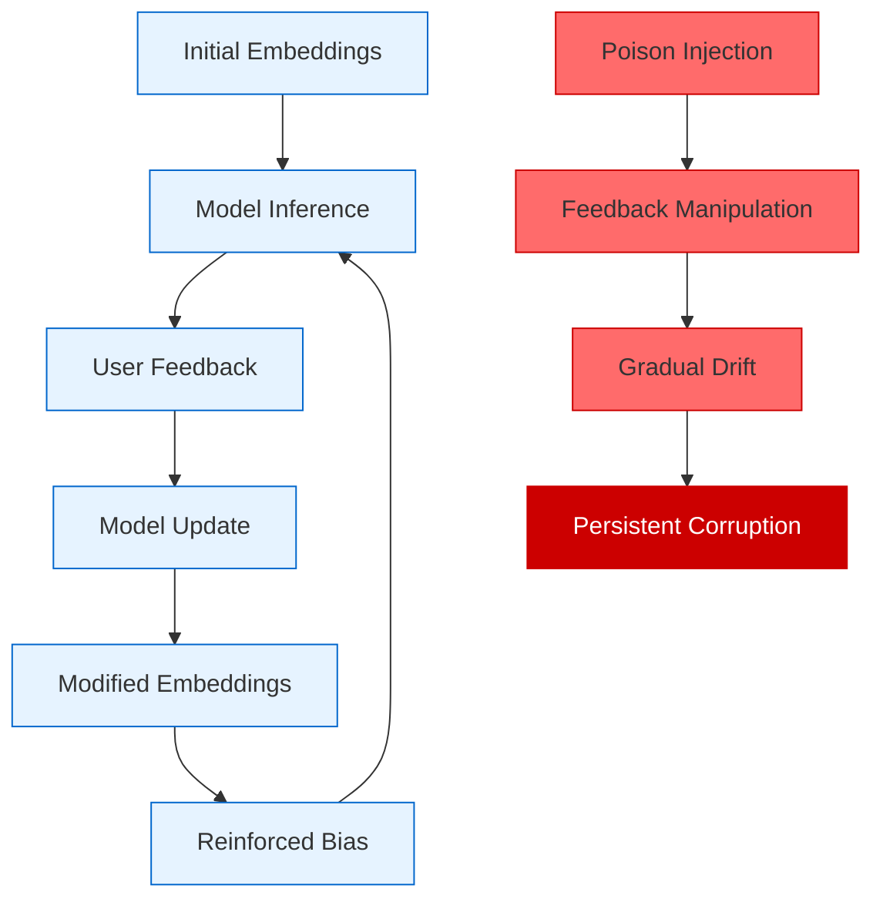
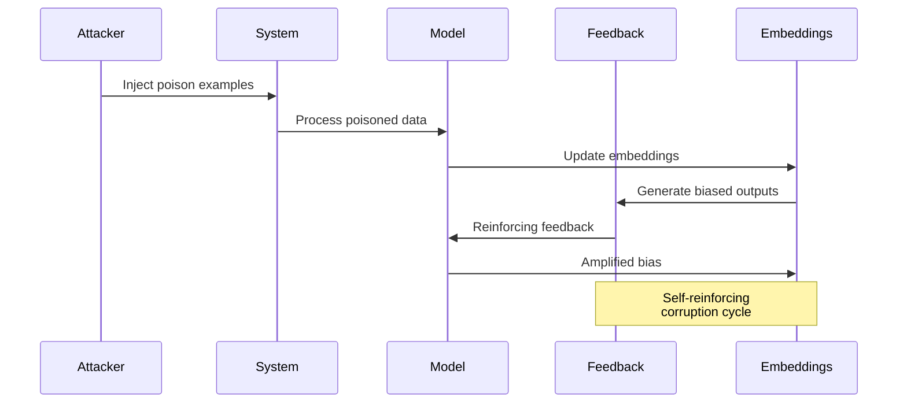

# 🔄 Embedding Feedback Loops *(Theoretical)*

Embedding Feedback Loops exploit continual learning systems by creating self-reinforcing cycles that gradually poison model representations through iterative feedback. These attacks leverage the dynamic nature of continuously updated embeddings to establish persistent and evolving adversarial patterns.

## 🎯 Attack Concept



## 🧠 Theoretical Foundation

### Continual Learning Vulnerabilities
Embedding Feedback Loops exploit fundamental properties of continual learning systems:

1. **Incremental Updates**: Models continuously adapt to new data
2. **Feedback Integration**: User interactions influence model behavior
3. **Representation Drift**: Embeddings evolve over time
4. **Memory Consolidation**: New patterns become permanently encoded

### Attack Mechanisms

#### 1. Gradient Accumulation Poisoning
Exploit gradient-based updates to bias learning direction:

```
Mathematical Concept:
- Standard update: θₜ₊₁ = θₜ - α∇L(θₜ, x, y)
- Poisoned update: θₜ₊₁ = θₜ - α∇L(θₜ, x, y) - β∇L_poison(θₜ, x_poison, y_poison)
- Where β controls poison influence and L_poison is adversarial loss
```

#### 2. Feedback Loop Amplification
Create self-reinforcing cycles through strategic feedback:

```
Concept:
- Inject initial bias through poisoned examples
- Manipulate feedback to reinforce bias
- Exploit confirmation bias in learning algorithms
- Achieve exponential amplification over time
```

#### 3. Memory Consolidation Attacks
Target long-term memory formation in continual learning:

```
Strategy:
- Identify critical consolidation periods
- Inject poison during memory formation
- Exploit rehearsal mechanisms
- Create persistent adversarial memories
```

## 🔄 Attack Flow



## 💥 Impact Assessment

### Stealth Characteristics
- **Gradual Progression**: Bias develops slowly over time
- **Feedback Integration**: Appears as natural learning
- **Self-Reinforcement**: Becomes stronger without additional input
- **Persistence**: Survives model checkpoints and rollbacks

### Attack Vectors
- **Recommendation Systems**: Bias content recommendations
- **Search Engines**: Manipulate result rankings
- **Content Moderation**: Evade or trigger false positives
- **Personalization**: Corrupt user profiles

## 🔍 Theoretical Detection Strategies

### Embedding Drift Monitoring
```python
class EmbeddingDriftMonitor:
    """Monitor embedding space for unusual drift patterns."""
    
    def __init__(self, window_size: int = 1000, drift_threshold: float = 0.1):
        self.window_size = window_size
        self.drift_threshold = drift_threshold
        self.embedding_history = []
        self.centroids_history = []
    
    def update(self, embeddings: np.ndarray):
        """Update monitor with new embeddings."""
        
        # Calculate current centroid
        current_centroid = np.mean(embeddings, axis=0)
        self.centroids_history.append(current_centroid)
        
        # Maintain window
        if len(self.centroids_history) > self.window_size:
            self.centroids_history.pop(0)
        
        # Store embeddings for analysis
        self.embedding_history.extend(embeddings.tolist())
        if len(self.embedding_history) > self.window_size * 100:
            self.embedding_history = self.embedding_history[-self.window_size * 100:]
    
    def detect_drift(self) -> Dict[str, float]:
        """Detect unusual drift patterns."""
        
        if len(self.centroids_history) < 10:
            return {"drift_score": 0.0, "acceleration": 0.0}
        
        # Calculate drift velocity and acceleration
        centroids = np.array(self.centroids_history)
        velocities = np.linalg.norm(np.diff(centroids, axis=0), axis=1)
        accelerations = np.diff(velocities)
        
        # Detect unusual patterns
        drift_score = np.mean(velocities[-10:]) / (np.mean(velocities[:-10]) + 1e-10)
        acceleration_score = np.mean(np.abs(accelerations[-5:]))
        
        return {
            "drift_score": drift_score,
            "acceleration": acceleration_score,
            "is_anomalous": drift_score > self.drift_threshold
        }
```

### Feedback Loop Detection
```python
def detect_feedback_loops(embeddings_timeline: List[np.ndarray], 
                         feedback_timeline: List[float]) -> Dict[str, float]:
    """Detect self-reinforcing feedback patterns."""
    
    # Calculate embedding changes over time
    embedding_changes = []
    for i in range(1, len(embeddings_timeline)):
        change = np.linalg.norm(embeddings_timeline[i] - embeddings_timeline[i-1])
        embedding_changes.append(change)
    
    # Calculate correlation with feedback
    if len(embedding_changes) != len(feedback_timeline[1:]):
        return {"correlation": 0.0, "loop_strength": 0.0}
    
    correlation = np.corrcoef(embedding_changes, feedback_timeline[1:])[0, 1]
    
    # Detect exponential growth patterns
    if len(embedding_changes) > 5:
        # Fit exponential model
        x = np.arange(len(embedding_changes))
        try:
            # Log transform for linear fit
            log_changes = np.log(np.array(embedding_changes) + 1e-10)
            slope, intercept = np.polyfit(x, log_changes, 1)
            exponential_growth = slope > 0.1  # Threshold for concerning growth
        except:
            exponential_growth = False
    else:
        exponential_growth = False
    
    loop_strength = abs(correlation) * (2.0 if exponential_growth else 1.0)
    
    return {
        "correlation": correlation,
        "exponential_growth": exponential_growth,
        "loop_strength": loop_strength,
        "is_loop": loop_strength > 0.7
    }
```

### Adversarial Pattern Recognition
```python
class AdversarialPatternDetector:
    """Detect patterns indicative of adversarial feedback loops."""
    
    def __init__(self):
        self.baseline_patterns = None
        self.anomaly_threshold = 2.0
    
    def fit_baseline(self, clean_embeddings: List[np.ndarray]):
        """Establish baseline patterns from clean data."""
        
        # Calculate various statistical measures
        all_embeddings = np.vstack(clean_embeddings)
        
        self.baseline_patterns = {
            'mean': np.mean(all_embeddings, axis=0),
            'std': np.std(all_embeddings, axis=0),
            'correlation_matrix': np.corrcoef(all_embeddings.T),
            'principal_components': self._calculate_pca(all_embeddings),
            'cluster_centers': self._calculate_clusters(all_embeddings)
        }
    
    def detect_adversarial_patterns(self, current_embeddings: np.ndarray) -> Dict[str, float]:
        """Detect adversarial patterns in current embeddings."""
        
        if self.baseline_patterns is None:
            raise ValueError("Must fit baseline patterns first")
        
        scores = {}
        
        # Statistical deviation
        mean_deviation = np.mean(np.abs(np.mean(current_embeddings, axis=0) - self.baseline_patterns['mean']))
        std_deviation = np.mean(np.abs(np.std(current_embeddings, axis=0) - self.baseline_patterns['std']))
        
        scores['statistical_anomaly'] = (mean_deviation + std_deviation) / 2
        
        # Correlation structure changes
        current_corr = np.corrcoef(current_embeddings.T)
        corr_deviation = np.mean(np.abs(current_corr - self.baseline_patterns['correlation_matrix']))
        scores['correlation_anomaly'] = corr_deviation
        
        # Principal component deviation
        current_pca = self._calculate_pca(current_embeddings)
        pca_deviation = np.mean(np.abs(current_pca - self.baseline_patterns['principal_components']))
        scores['pca_anomaly'] = pca_deviation
        
        # Overall anomaly score
        scores['overall_anomaly'] = np.mean(list(scores.values()))
        scores['is_adversarial'] = scores['overall_anomaly'] > self.anomaly_threshold
        
        return scores
    
    def _calculate_pca(self, embeddings: np.ndarray, n_components: int = 10) -> np.ndarray:
        """Calculate principal components."""
        from sklearn.decomposition import PCA
        pca = PCA(n_components=n_components)
        return pca.fit_transform(embeddings).flatten()[:n_components]
    
    def _calculate_clusters(self, embeddings: np.ndarray, n_clusters: int = 5) -> np.ndarray:
        """Calculate cluster centers."""
        from sklearn.cluster import KMeans
        kmeans = KMeans(n_clusters=n_clusters, random_state=42)
        kmeans.fit(embeddings)
        return kmeans.cluster_centers_.flatten()
```

## 🛡️ Theoretical Defense Mechanisms

### 1. Feedback Validation
```python
class FeedbackValidator:
    """Validate feedback to prevent adversarial loops."""
    
    def __init__(self, consistency_threshold: float = 0.8):
        self.consistency_threshold = consistency_threshold
        self.feedback_history = []
        self.user_profiles = {}
    
    def validate_feedback(self, user_id: str, feedback: float, context: Dict) -> bool:
        """Validate if feedback is consistent and trustworthy."""
        
        # Check user consistency
        if user_id in self.user_profiles:
            user_consistency = self._calculate_user_consistency(user_id, feedback, context)
            if user_consistency < self.consistency_threshold:
                return False
        
        # Check temporal consistency
        temporal_consistency = self._check_temporal_consistency(feedback, context)
        if temporal_consistency < self.consistency_threshold:
            return False
        
        # Check for coordinated attacks
        coordination_score = self._detect_coordination(feedback, context)
        if coordination_score > 0.7:
            return False
        
        # Update profiles
        self._update_user_profile(user_id, feedback, context)
        
        return True
    
    def _calculate_user_consistency(self, user_id: str, feedback: float, context: Dict) -> float:
        """Calculate consistency of user feedback patterns."""
        
        user_history = self.user_profiles.get(user_id, [])
        if len(user_history) < 3:
            return 1.0  # Insufficient data
        
        # Calculate variance in feedback patterns
        recent_feedback = [entry['feedback'] for entry in user_history[-10:]]
        feedback_variance = np.var(recent_feedback)
        
        # Normalize to 0-1 scale (lower variance = higher consistency)
        consistency = 1.0 / (1.0 + feedback_variance)
        
        return consistency
    
    def _check_temporal_consistency(self, feedback: float, context: Dict) -> float:
        """Check if feedback timing patterns are natural."""
        
        current_time = context.get('timestamp', time.time())
        
        # Check for unusual timing patterns
        recent_feedback = [entry for entry in self.feedback_history[-100:] 
                          if current_time - entry['timestamp'] < 3600]  # Last hour
        
        if len(recent_feedback) > 50:  # Too much feedback too quickly
            return 0.0
        
        # Check for regular intervals (bot-like behavior)
        if len(recent_feedback) > 5:
            intervals = np.diff([entry['timestamp'] for entry in recent_feedback])
            interval_variance = np.var(intervals)
            if interval_variance < 1.0:  # Too regular
                return 0.0
        
        return 1.0
    
    def _detect_coordination(self, feedback: float, context: Dict) -> float:
        """Detect coordinated feedback attacks."""
        
        current_time = context.get('timestamp', time.time())
        
        # Look for similar feedback in short time window
        recent_similar = [entry for entry in self.feedback_history[-50:] 
                         if abs(entry['feedback'] - feedback) < 0.1 
                         and current_time - entry['timestamp'] < 300]  # 5 minutes
        
        coordination_score = len(recent_similar) / 10.0  # Normalize
        
        return min(coordination_score, 1.0)
    
    def _update_user_profile(self, user_id: str, feedback: float, context: Dict):
        """Update user profile with new feedback."""
        
        if user_id not in self.user_profiles:
            self.user_profiles[user_id] = []
        
        entry = {
            'feedback': feedback,
            'timestamp': context.get('timestamp', time.time()),
            'context': context
        }
        
        self.user_profiles[user_id].append(entry)
        
        # Maintain history size
        if len(self.user_profiles[user_id]) > 100:
            self.user_profiles[user_id] = self.user_profiles[user_id][-100:]
```

### 2. Embedding Regularization
```python
class EmbeddingRegularizer:
    """Regularize embedding updates to prevent adversarial drift."""
    
    def __init__(self, drift_penalty: float = 0.1, stability_weight: float = 0.5):
        self.drift_penalty = drift_penalty
        self.stability_weight = stability_weight
        self.reference_embeddings = None
    
    def set_reference(self, embeddings: np.ndarray):
        """Set reference embeddings for stability."""
        self.reference_embeddings = np.copy(embeddings)
    
    def regularize_update(self, current_embeddings: np.ndarray, 
                         proposed_update: np.ndarray) -> np.ndarray:
        """Apply regularization to embedding updates."""
        
        if self.reference_embeddings is None:
            return proposed_update
        
        # Calculate drift from reference
        drift = np.linalg.norm(current_embeddings - self.reference_embeddings, axis=1)
        
        # Apply drift penalty
        drift_penalty = self.drift_penalty * np.mean(drift)
        
        # Regularized update
        regularized_update = (1 - self.stability_weight) * proposed_update
        
        # Add stability term
        stability_term = self.stability_weight * (self.reference_embeddings - current_embeddings)
        
        final_update = regularized_update + stability_term - drift_penalty
        
        return final_update
```

### 3. Multi-Model Consensus
```python
class ConsensusLearning:
    """Use multiple models to prevent single-point-of-failure attacks."""
    
    def __init__(self, models: List[Any], consensus_threshold: float = 0.7):
        self.models = models
        self.consensus_threshold = consensus_threshold
    
    def consensus_update(self, data: np.ndarray, feedback: np.ndarray) -> List[np.ndarray]:
        """Update models using consensus mechanism."""
        
        # Get proposed updates from each model
        proposed_updates = []
        for model in self.models:
            update = model.propose_update(data, feedback)
            proposed_updates.append(update)
        
        # Calculate consensus
        consensus_update = self._calculate_consensus(proposed_updates)
        
        # Apply consensus update to all models
        final_updates = []
        for i, model in enumerate(self.models):
            # Blend individual update with consensus
            blended_update = (0.3 * proposed_updates[i] + 
                            0.7 * consensus_update)
            final_updates.append(blended_update)
        
        return final_updates
    
    def _calculate_consensus(self, updates: List[np.ndarray]) -> np.ndarray:
        """Calculate consensus from multiple proposed updates."""
        
        # Use median to reduce impact of outliers
        updates_array = np.array(updates)
        consensus = np.median(updates_array, axis=0)
        
        return consensus
    
    def detect_outlier_models(self, updates: List[np.ndarray]) -> List[int]:
        """Detect models proposing outlier updates."""
        
        consensus = self._calculate_consensus(updates)
        
        outliers = []
        for i, update in enumerate(updates):
            distance = np.linalg.norm(update - consensus)
            if distance > self.consensus_threshold:
                outliers.append(i)
        
        return outliers
```

## 📊 Theoretical Success Metrics

- **Drift Magnitude**: Degree of embedding space corruption achieved
- **Persistence**: Duration of attack effects after injection stops
- **Amplification Factor**: Rate of bias growth through feedback loops
- **Detection Evasion**: Ability to avoid drift monitoring systems
- **Cross-Domain Transfer**: Effectiveness across different model types

## ⚠️ Ethical Considerations

This theoretical attack could enable:
- Long-term manipulation of AI systems
- Persistent bias injection in recommendation systems
- Corruption of personalization algorithms
- Undermining of continual learning systems

Research should focus on:
- Understanding feedback loop vulnerabilities
- Developing robust continual learning algorithms
- Creating monitoring systems for embedding drift
- Establishing safeguards for feedback integration

## 🔗 Related Research Areas

- **Continual Learning**: Lifelong learning system vulnerabilities
- **Online Learning**: Adaptive algorithm security
- **Adversarial Machine Learning**: Long-term attack strategies
- **Recommendation Systems**: Bias injection and manipulation
- **Human-AI Interaction**: Feedback mechanism security