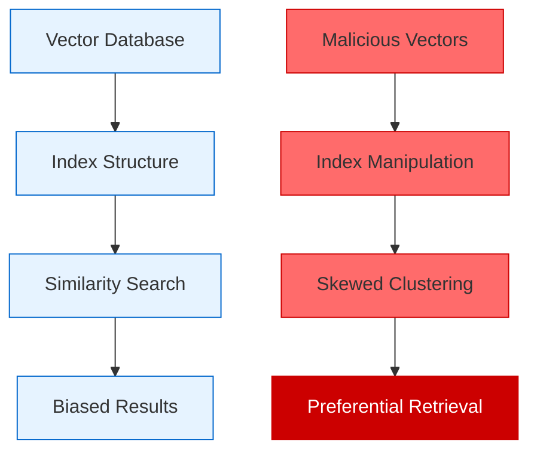
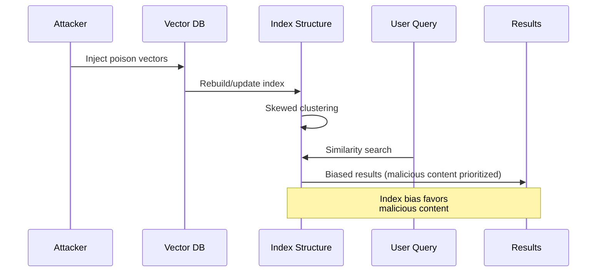

# 📊 Index Skew Attacks *(Theoretical)*

Index Skew Attacks exploit vector database indexing mechanisms by systematically biasing index structures to favor malicious content retrieval. These attacks manipulate the mathematical properties of high-dimensional vector spaces to create preferential pathways that surface adversarial content during similarity searches.

## 🎯 Attack Concept



## 🧠 Theoretical Foundation

### Vector Space Manipulation
Index Skew Attacks leverage the mathematical properties of high-dimensional vector spaces where:

1. **Curse of Dimensionality**: In high dimensions, most vectors appear equidistant
2. **Index Clustering**: Similar vectors are grouped for efficient retrieval
3. **Centroid Bias**: Index structures often use centroids for partitioning
4. **Distance Metrics**: Different metrics (cosine, euclidean) create different neighborhoods

### Attack Vectors

#### 1. Centroid Poisoning
Inject vectors strategically positioned to shift cluster centroids:

```
Mathematical Concept:
- Original centroid: C = (v₁ + v₂ + ... + vₙ) / n
- Poisoned centroid: C' = (v₁ + v₂ + ... + vₙ + p₁ + p₂ + ... + pₘ) / (n + m)
- Where p₁, p₂, ..., pₘ are carefully crafted poison vectors
```

#### 2. Dimensional Bias Injection
Exploit specific dimensions that disproportionately influence similarity calculations:

```
Concept:
- Identify high-variance dimensions in the embedding space
- Inject vectors with extreme values in these dimensions
- Create "attractors" that pull queries toward malicious content
```

#### 3. Hierarchical Index Corruption
Target tree-based index structures (LSH, Ball Trees, KD-Trees):

```
Strategy:
- Poison vectors at decision boundaries
- Force misclassification of legitimate queries
- Create "shortcut" paths to malicious content
```

## 🔄 Attack Flow



## 💥 Impact Assessment

### Stealth Characteristics
- **Mathematical Subtlety**: Exploits inherent properties of high-dimensional spaces
- **Index Integration**: Poison vectors appear as legitimate embeddings
- **Query Independence**: Affects all queries, not just targeted ones
- **Persistent Bias**: Remains effective across index rebuilds

### Detection Challenges
- **High-Dimensional Complexity**: Difficult to visualize or analyze bias patterns
- **Statistical Camouflage**: Poison vectors may appear statistically normal
- **Gradual Degradation**: Bias may develop slowly over time
- **Metric Dependency**: Different distance metrics may hide the attack

## 🔍 Theoretical Detection Strategies

### Statistical Analysis
```python
def detect_index_skew(vectors: np.ndarray, queries: np.ndarray, results: List[List[int]]) -> float:
    """Detect potential index skew through statistical analysis."""
    
    # Analyze result distribution
    result_frequencies = Counter([item for sublist in results for item in sublist])
    
    # Calculate expected vs actual retrieval rates
    expected_rate = 1.0 / len(vectors)
    actual_rates = [freq / len(queries) for freq in result_frequencies.values()]
    
    # Measure deviation from uniform distribution
    chi_square = sum((actual - expected_rate) ** 2 / expected_rate for actual in actual_rates)
    
    return chi_square
```

### Centroid Drift Analysis
```python
def analyze_centroid_drift(embeddings: np.ndarray, time_windows: List[Tuple[int, int]]) -> List[float]:
    """Analyze how cluster centroids change over time."""
    
    drifts = []
    for i in range(len(time_windows) - 1):
        # Calculate centroids for consecutive time windows
        window1 = embeddings[time_windows[i][0]:time_windows[i][1]]
        window2 = embeddings[time_windows[i+1][0]:time_windows[i+1][1]]
        
        centroid1 = np.mean(window1, axis=0)
        centroid2 = np.mean(window2, axis=0)
        
        # Measure drift magnitude
        drift = np.linalg.norm(centroid2 - centroid1)
        drifts.append(drift)
    
    return drifts
```

### Dimensional Variance Monitoring
```python
def monitor_dimensional_variance(embeddings: np.ndarray) -> np.ndarray:
    """Monitor variance across embedding dimensions."""
    
    # Calculate variance for each dimension
    variances = np.var(embeddings, axis=0)
    
    # Identify dimensions with unusual variance patterns
    z_scores = (variances - np.mean(variances)) / np.std(variances)
    
    return z_scores
```

## 🛡️ Theoretical Defense Mechanisms

### 1. Robust Index Construction
```python
class RobustIndexBuilder:
    """Build indices resistant to skew attacks."""
    
    def __init__(self, outlier_threshold: float = 3.0):
        self.outlier_threshold = outlier_threshold
    
    def build_robust_index(self, vectors: np.ndarray) -> Any:
        """Build index with outlier filtering."""
        
        # Detect and filter outliers
        filtered_vectors = self.filter_outliers(vectors)
        
        # Use ensemble of different index types
        indices = [
            self.build_lsh_index(filtered_vectors),
            self.build_ball_tree_index(filtered_vectors),
            self.build_ivf_index(filtered_vectors)
        ]
        
        return EnsembleIndex(indices)
    
    def filter_outliers(self, vectors: np.ndarray) -> np.ndarray:
        """Filter potential poison vectors."""
        
        # Calculate distances to centroid
        centroid = np.mean(vectors, axis=0)
        distances = np.linalg.norm(vectors - centroid, axis=1)
        
        # Filter based on z-score
        z_scores = (distances - np.mean(distances)) / np.std(distances)
        mask = np.abs(z_scores) < self.outlier_threshold
        
        return vectors[mask]
```

### 2. Multi-Metric Validation
```python
def validate_with_multiple_metrics(query: np.ndarray, candidates: np.ndarray) -> List[int]:
    """Validate results using multiple distance metrics."""
    
    metrics = [
        lambda q, c: cosine_similarity(q, c),
        lambda q, c: euclidean_distance(q, c),
        lambda q, c: manhattan_distance(q, c),
        lambda q, c: dot_product(q, c)
    ]
    
    # Get top results for each metric
    results_per_metric = []
    for metric in metrics:
        scores = [metric(query, candidate) for candidate in candidates]
        top_indices = np.argsort(scores)[:10]
        results_per_metric.append(set(top_indices))
    
    # Return intersection of results
    consensus_results = set.intersection(*results_per_metric)
    return list(consensus_results)
```

### 3. Temporal Consistency Checking
```python
class TemporalConsistencyChecker:
    """Monitor index behavior over time."""
    
    def __init__(self, window_size: int = 1000):
        self.window_size = window_size
        self.historical_results = []
    
    def check_consistency(self, current_results: List[int]) -> float:
        """Check if current results are consistent with historical patterns."""
        
        if len(self.historical_results) < 2:
            self.historical_results.append(current_results)
            return 1.0
        
        # Calculate similarity with recent results
        similarities = []
        for historical in self.historical_results[-5:]:
            similarity = len(set(current_results) & set(historical)) / len(set(current_results) | set(historical))
            similarities.append(similarity)
        
        consistency_score = np.mean(similarities)
        self.historical_results.append(current_results)
        
        # Maintain window size
        if len(self.historical_results) > self.window_size:
            self.historical_results.pop(0)
        
        return consistency_score
```

## 📊 Theoretical Success Metrics

- **Bias Magnitude**: Degree of skew introduced into index structure
- **Coverage Rate**: Percentage of queries affected by the bias
- **Stealth Score**: Ability to remain undetected by statistical analysis
- **Persistence**: Durability across index rebuilds and updates
- **Cross-Metric Effectiveness**: Success across different similarity metrics

## ⚠️ Ethical Considerations

This theoretical attack could compromise the integrity of vector databases used in:
- Recommendation systems
- Content moderation
- Information retrieval
- Semantic search

Research should focus on:
- Understanding vulnerability patterns
- Developing robust indexing methods
- Creating detection mechanisms
- Improving vector database security

## 🔗 Related Research Areas

- **Adversarial Machine Learning**: Similar manipulation techniques
- **High-Dimensional Geometry**: Mathematical foundations
- **Information Retrieval**: Index structure vulnerabilities
- **Robust Statistics**: Outlier detection and filtering methods