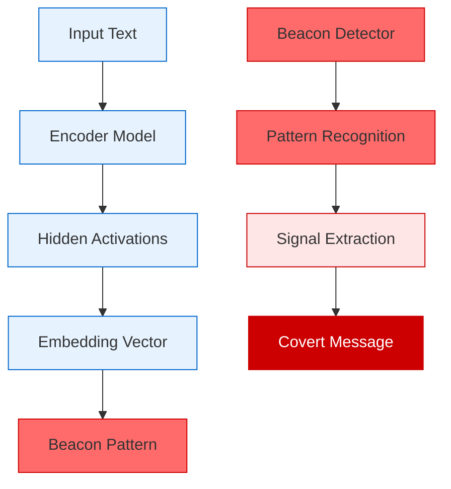
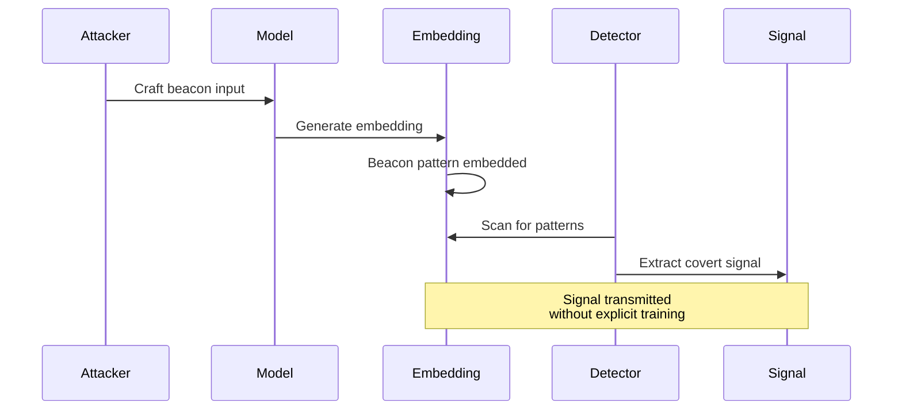

# 📡 Zero-Shot Vector Beaconing *(Theoretical)*

Zero-Shot Vector Beaconing exploits latent activation patterns in neural networks to embed covert signaling mechanisms within vector embeddings. This attack creates hidden communication channels that can transmit information or trigger behaviors without explicit training or fine-tuning.

## 🎯 Attack Concept



## 🧠 Theoretical Foundation

### Neural Activation Patterns
Zero-Shot Vector Beaconing leverages the fact that neural networks create consistent activation patterns for similar inputs, even without explicit training:

1. **Latent Space Structure**: Pre-trained models develop rich internal representations
2. **Activation Consistency**: Similar inputs produce similar activation patterns
3. **Dimensional Redundancy**: High-dimensional embeddings contain exploitable redundancy
4. **Pattern Emergence**: Complex patterns can emerge from simple input modifications

### Beacon Mechanisms

#### 1. Dimensional Signature Beaconing
Embed signals in specific embedding dimensions:

```
Mathematical Concept:
- Standard embedding: E = [e₁, e₂, ..., eₙ]
- Beacon embedding: E' = [e₁, e₂, ..., eᵢ + δᵢ, ..., eₙ]
- Where δᵢ represents the beacon signal in dimension i
```

#### 2. Frequency Domain Beaconing
Use spectral properties of embeddings for signaling:

```
Concept:
- Apply FFT to embedding vector: F = FFT(E)
- Embed signal in specific frequency bins
- Signal remains detectable after inverse transform
```

#### 3. Statistical Moment Beaconing
Exploit higher-order statistical moments:

```
Strategy:
- Modify embedding to achieve specific skewness/kurtosis
- Use moments as carrier for covert information
- Preserve semantic meaning while embedding signal
```

## 🔄 Attack Flow



## 💥 Impact Assessment

### Stealth Characteristics
- **Zero-Shot Nature**: No model modification required
- **Semantic Preservation**: Maintains apparent meaning of content
- **Model Agnostic**: Works across different architectures
- **Detection Resistance**: Hidden in high-dimensional noise

### Potential Applications
- **Covert Communication**: Hidden messaging in embeddings
- **Trigger Activation**: Remote activation of dormant behaviors
- **Data Exfiltration**: Embedding sensitive information in vectors
- **Model Fingerprinting**: Identifying specific model instances

## 🔍 Theoretical Detection Strategies

### Statistical Anomaly Detection
```python
def detect_beacon_anomalies(embeddings: np.ndarray, baseline: np.ndarray) -> List[float]:
    """Detect statistical anomalies that might indicate beaconing."""
    
    anomaly_scores = []
    
    for embedding in embeddings:
        # Calculate statistical moments
        mean_diff = abs(np.mean(embedding) - np.mean(baseline))
        var_diff = abs(np.var(embedding) - np.var(baseline))
        skew_diff = abs(scipy.stats.skew(embedding) - scipy.stats.skew(baseline))
        kurt_diff = abs(scipy.stats.kurtosis(embedding) - scipy.stats.kurtosis(baseline))
        
        # Combine into anomaly score
        anomaly_score = mean_diff + var_diff + skew_diff + kurt_diff
        anomaly_scores.append(anomaly_score)
    
    return anomaly_scores
```

### Frequency Domain Analysis
```python
def analyze_frequency_domain(embeddings: np.ndarray) -> np.ndarray:
    """Analyze embeddings in frequency domain for beacon patterns."""
    
    frequency_features = []
    
    for embedding in embeddings:
        # Apply FFT
        fft_result = np.fft.fft(embedding)
        
        # Extract magnitude spectrum
        magnitude = np.abs(fft_result)
        
        # Look for unusual peaks or patterns
        peak_indices = scipy.signal.find_peaks(magnitude, height=np.mean(magnitude) + 2*np.std(magnitude))[0]
        
        frequency_features.append({
            'peak_count': len(peak_indices),
            'peak_positions': peak_indices,
            'spectral_entropy': scipy.stats.entropy(magnitude),
            'dominant_frequency': np.argmax(magnitude)
        })
    
    return frequency_features
```

### Dimensional Correlation Analysis
```python
def analyze_dimensional_correlations(embeddings: np.ndarray) -> np.ndarray:
    """Analyze correlations between embedding dimensions."""
    
    # Calculate correlation matrix
    correlation_matrix = np.corrcoef(embeddings.T)
    
    # Identify unusual correlation patterns
    high_correlations = np.where(np.abs(correlation_matrix) > 0.8)
    
    # Calculate correlation entropy
    correlation_entropy = -np.sum(correlation_matrix * np.log(np.abs(correlation_matrix) + 1e-10))
    
    return {
        'correlation_matrix': correlation_matrix,
        'high_correlation_pairs': list(zip(high_correlations[0], high_correlations[1])),
        'correlation_entropy': correlation_entropy
    }
```

## 🛡️ Theoretical Defense Mechanisms

### 1. Embedding Normalization
```python
class EmbeddingNormalizer:
    """Normalize embeddings to remove potential beacon signals."""
    
    def __init__(self, method: str = 'z_score'):
        self.method = method
        self.baseline_stats = None
    
    def fit(self, baseline_embeddings: np.ndarray):
        """Fit normalizer on clean baseline embeddings."""
        self.baseline_stats = {
            'mean': np.mean(baseline_embeddings, axis=0),
            'std': np.std(baseline_embeddings, axis=0),
            'median': np.median(baseline_embeddings, axis=0),
            'mad': scipy.stats.median_abs_deviation(baseline_embeddings, axis=0)
        }
    
    def normalize(self, embeddings: np.ndarray) -> np.ndarray:
        """Normalize embeddings to remove statistical anomalies."""
        
        if self.method == 'z_score':
            return (embeddings - self.baseline_stats['mean']) / (self.baseline_stats['std'] + 1e-10)
        elif self.method == 'robust':
            return (embeddings - self.baseline_stats['median']) / (self.baseline_stats['mad'] + 1e-10)
        else:
            raise ValueError(f"Unknown normalization method: {self.method}")
```

### 2. Spectral Filtering
```python
def apply_spectral_filter(embeddings: np.ndarray, cutoff_freq: float = 0.1) -> np.ndarray:
    """Apply low-pass filter to remove high-frequency beacon signals."""
    
    filtered_embeddings = []
    
    for embedding in embeddings:
        # Apply FFT
        fft_result = np.fft.fft(embedding)
        
        # Create low-pass filter
        freqs = np.fft.fftfreq(len(embedding))
        filter_mask = np.abs(freqs) <= cutoff_freq
        
        # Apply filter
        filtered_fft = fft_result * filter_mask
        
        # Inverse FFT
        filtered_embedding = np.real(np.fft.ifft(filtered_fft))
        filtered_embeddings.append(filtered_embedding)
    
    return np.array(filtered_embeddings)
```

### 3. Adversarial Noise Injection
```python
class AdversarialNoiseInjector:
    """Inject noise to disrupt beacon patterns while preserving semantics."""
    
    def __init__(self, noise_level: float = 0.01):
        self.noise_level = noise_level
    
    def inject_noise(self, embeddings: np.ndarray) -> np.ndarray:
        """Inject carefully calibrated noise to disrupt beacons."""
        
        # Generate noise with same dimensionality
        noise = np.random.normal(0, self.noise_level, embeddings.shape)
        
        # Apply noise with semantic preservation
        noisy_embeddings = embeddings + noise
        
        # Normalize to preserve magnitude
        norms = np.linalg.norm(embeddings, axis=1, keepdims=True)
        noisy_norms = np.linalg.norm(noisy_embeddings, axis=1, keepdims=True)
        
        return noisy_embeddings * (norms / (noisy_norms + 1e-10))
```

### 4. Multi-Model Consensus
```python
class MultiModelConsensus:
    """Use multiple models to detect and filter beacon patterns."""
    
    def __init__(self, models: List[Any]):
        self.models = models
    
    def generate_consensus_embedding(self, text: str) -> np.ndarray:
        """Generate embedding using consensus from multiple models."""
        
        embeddings = []
        for model in self.models:
            embedding = model.encode(text)
            embeddings.append(embedding)
        
        # Calculate consensus embedding
        embeddings = np.array(embeddings)
        
        # Use median to reduce impact of outliers/beacons
        consensus_embedding = np.median(embeddings, axis=0)
        
        return consensus_embedding
    
    def detect_outlier_models(self, text: str, threshold: float = 2.0) -> List[int]:
        """Detect models producing outlier embeddings."""
        
        embeddings = []
        for model in self.models:
            embedding = model.encode(text)
            embeddings.append(embedding)
        
        embeddings = np.array(embeddings)
        
        # Calculate distances from median
        median_embedding = np.median(embeddings, axis=0)
        distances = [np.linalg.norm(emb - median_embedding) for emb in embeddings]
        
        # Identify outliers
        mean_distance = np.mean(distances)
        std_distance = np.std(distances)
        outlier_indices = [i for i, d in enumerate(distances) if d > mean_distance + threshold * std_distance]
        
        return outlier_indices
```

## 📊 Theoretical Success Metrics

- **Signal Fidelity**: Accuracy of beacon signal transmission
- **Semantic Preservation**: Maintenance of original content meaning
- **Detection Evasion**: Ability to avoid statistical detection methods
- **Cross-Model Consistency**: Effectiveness across different model architectures
- **Bandwidth Efficiency**: Amount of information transmitted per embedding

## ⚠️ Ethical Considerations

This theoretical attack could enable:
- Covert communication in monitored environments
- Hidden data exfiltration through embeddings
- Unauthorized model behavior triggering
- Steganographic information hiding

Research should focus on:
- Understanding beacon detection limits
- Developing robust filtering mechanisms
- Creating monitoring systems for embedding integrity
- Establishing security standards for vector databases

## 🔗 Related Research Areas

- **Steganography**: Hidden information transmission techniques
- **Neural Network Interpretability**: Understanding latent representations
- **Adversarial Machine Learning**: Model manipulation techniques
- **Signal Processing**: Frequency domain analysis and filtering
- **Information Theory**: Covert channel capacity and detection